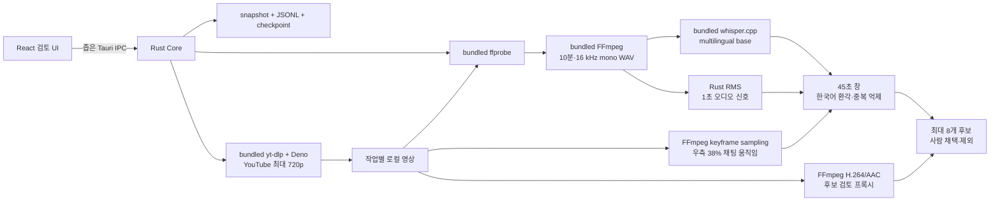

# 아키텍처와 상태 모델

## 현재 실제 경로



React는 임의 명령, PID, 파일 시스템을 다루지 않습니다. Rust가 입력 검증, 고정된 실행 파일과 인자, 자식 프로세스 종료, 저장을 소유합니다.

## 청크와 점수

- `ffprobe`: 재생 시간과 오디오 스트림 존재 확인
- FFmpeg: 10분씩 16 kHz mono PCM WAV 생성
- whisper.cpp: 한국어 고정, 무음 억제 옵션으로 SRT 생성
- Rust: WAV를 1초 단위 RMS로 읽고 SRT 타임코드를 원본 시간으로 보정
- 채팅 움직임: 화면 오른쪽 38%를 64x64 grayscale로 축소해 5초 간격 키프레임 변화량 계산
- 후보 창: 최대 45초
- 점수: 채팅 신호가 있으면 오디오 45% + 발화 35% + 채팅 20%, 없으면 오디오 55% + 발화 45%
- 중복 제거: 후보 시간 겹침 금지, 전사 Jaccard 유사도 0.75 이상 제거
- 플레이어: 후보 앞뒤 여유를 둔 최대 720p H.264/AAC 프록시를 생성하고 작업 안에서 캐시

규칙 점수는 “재미”의 확률이 아니라 먼저 볼 순서를 정하는 휴리스틱입니다.

## 상태

실제 미디어 경로:

`CREATED → ACQUIRING → PROBING → TRANSCRIBING* → AUDIO_SIGNALS → FUSING → RANKING → REVIEW_READY`

YouTube 입력에서 `ACQUIRING`은 yt-dlp 다운로드를 뜻하며 완료 영상과 `acquisition.json`을 저장합니다. 로컬 입력에서는 내장 도구 확인 단계입니다.

`TRANSCRIBING` 한 단위가 한 청크의 FFmpeg 추출·Whisper 전사·체크포인트 저장을 뜻합니다.

교차 상태:

- `CANCELLING → CANCELLED`: 현재 자식 프로세스를 `kill + wait`하고 완료 청크 보존
- 모든 실제 미디어 자식은 Windows Job Object의 `KILL_ON_JOB_CLOSE`에 넣어 부모 앱 강제 종료 시에도 함께 종료
- `INTERRUPTED`: 앱 강제 종료 뒤 복원
- `FAILED`: 도구·입력·체크포인트 오류
- `REVIEW_READY`: 후보 판정 가능

데모 경로는 기존 12단위 fixture와 오류 프로토콜을 유지합니다.

## 저장 구조

```text
%LOCALAPPDATA%/com.vodscout.app/
├─ current-job.json
└─ jobs/{job-id}/
   ├─ snapshot.json
   ├─ snapshot.prev.json
   ├─ events.jsonl
   ├─ acquisition.json          # YouTube 입력만
   ├─ youtube-download/         # 완료 영상, 재개용 .part, yt-dlp cache
   ├─ media-checkpoint.json
   ├─ transcript.json
   ├─ chat-motion.json
   ├─ review-clips/
   │  └─ candidate-01.mp4
   └─ tool-logs/
      ├─ ffprobe.stderr.log
      ├─ yt-dlp.stderr.log
      ├─ ffmpeg-0000.stderr.log
      └─ whisper-0000.stderr.log
```

WAV와 SRT는 한 청크만 작업 디렉터리에 두고 체크포인트 저장 후 삭제합니다. 8시간 영상을 한꺼번에 PCM으로 펼치지 않습니다.

## 재개 일관성

체크포인트를 먼저 저장하고 작업 스냅샷 진행 단위를 다음에 저장합니다. 두 쓰기 사이에서 종료되면 스냅샷보다 앞선 체크포인트 한 청크를 롤백해 다시 처리합니다. 스냅샷이 체크포인트보다 앞서는 손상은 자동으로 숨기지 않고 실패로 표시합니다.

## 배포 리소스

- FFmpeg 8.1 LGPL shared
- whisper.cpp 1.9.1 CPU x64
- multilingual `ggml-base.bin`
- yt-dlp 2026.07.04 Windows x64
- Deno 2.9.4 Windows x64
- 각 원본 URL·SHA-256: `src-tauri/resources/media-tools/manifest.json`
- 라이선스: `src-tauri/resources/media-tools/licenses`
