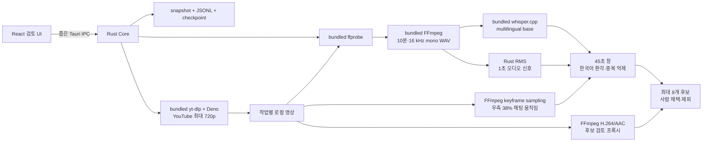
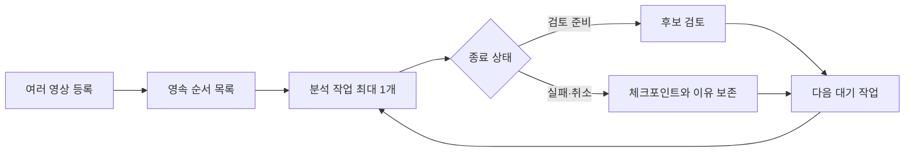

# 아키텍처와 상태 모델

## 현재 실제 경로



React는 임의 명령, PID, 파일 시스템을 다루지 않습니다. Rust가 입력 검증, 고정된 실행 파일과 인자, 자식 프로세스 종료, 저장을 소유합니다.

React 검토 UI의 구현 담당은 버전 시작 승인 시 확정하며 현재 문서 정본은 Codex/Sol이 관리합니다.

## 청크와 점수

- `ffprobe`: 재생 시간과 오디오 스트림 존재 확인
- FFmpeg: 10분씩 16 kHz mono PCM WAV 생성
- whisper.cpp: 한국어 고정, 무음 억제 옵션으로 SRT 생성
- Rust: WAV를 1초 단위 RMS로 읽고 SRT 타임코드를 원본 시간으로 보정
- 채팅 움직임: 화면 오른쪽 38%를 64x64 grayscale로 축소해 5초 간격 키프레임 변화량 계산
- 후보 창: 최대 45초
- 점수: 채팅 신호가 있으면 오디오 45% + 발화 35% + 채팅 20%, 없으면 오디오 55% + 발화 45%
- 중복 제거: 후보 시간 겹침 금지, 음성 인식 문장 Jaccard 유사도 0.75 이상 제거
- 플레이어: 후보 앞뒤 여유를 둔 최대 720p H.264/AAC 프록시를 생성하고 작업 안에서 캐시

규칙 점수는 “재미”의 확률이 아니라 먼저 볼 순서를 정하는 휴리스틱입니다.

## 상태

실제 미디어 경로:

`CREATED → ACQUIRING → PROBING → TRANSCRIBING* → AUDIO_SIGNALS → FUSING → RANKING → REVIEW_READY`

YouTube 입력에서 `ACQUIRING`은 yt-dlp 다운로드를 뜻하며 완료 영상과 `acquisition.json`을 저장합니다. 로컬 입력에서는 내장 도구 확인 단계입니다.

`TRANSCRIBING` 한 단위가 한 청크의 FFmpeg 추출·Whisper 음성 인식·체크포인트 저장을 뜻합니다.

교차 상태:

- `CANCELLING → CANCELLED`: 현재 자식 프로세스를 `kill + wait`하고 완료 청크 보존
- 모든 실제 미디어 자식은 Windows Job Object의 `KILL_ON_JOB_CLOSE`에 넣어 부모 앱 강제 종료 시에도 함께 종료
- `INTERRUPTED`: 앱 강제 종료 뒤 복원하며 사용자 선택 없이 자동 재개하지 않음
- `FAILED`: 도구·입력·체크포인트 오류
- `REVIEW_READY`: 후보 판정 가능

데모 경로는 기존 12단위 fixture와 오류 프로토콜을 유지합니다.

## 저장 구조

```text
%LOCALAPPDATA%/com.vodscout.app/
├─ queue.json
├─ queue.prev.json
├─ current-job.json
└─ jobs/{job-id}/
   ├─ snapshot.json
   ├─ snapshot.prev.json
   ├─ events.jsonl
   ├─ acquisition.json          # YouTube 입력만
   ├─ youtube-download/         # 완료 영상, 재개용 .part, yt-dlp cache
   ├─ media-checkpoint.json
   ├─ transcript.json
   ├─ chat-motion.json
   ├─ review-clips/
   │  └─ candidate-01.mp4
   └─ tool-logs/
      ├─ ffprobe.stderr.log
      ├─ yt-dlp.stderr.log
      ├─ ffmpeg-0000.stderr.log
      └─ whisper-0000.stderr.log
```

`queue.json`은 대기 순서, 스키마 버전, 순차 전환 상태만 원자적으로 저장하고 `queue.prev.json`에 직전 정상본을 남깁니다. 작업 상태·설정·체크포인트·후보는 `jobs/{job-id}` 정본에서 읽으며 같은 값을 대기열 파일에 중복 저장하지 않습니다.

WAV와 SRT는 한 청크만 작업 디렉터리에 두고 체크포인트 저장 후 삭제합니다. 8시간 영상을 한꺼번에 PCM으로 펼치지 않습니다.

## 재개 일관성

체크포인트를 먼저 저장하고 작업 스냅샷 진행 단위를 다음에 저장합니다. 두 쓰기 사이에서 종료되면 스냅샷보다 앞선 체크포인트 한 청크를 롤백해 다시 처리합니다. 스냅샷이 체크포인트보다 앞서는 손상은 자동으로 숨기지 않고 실패로 표시합니다.

## 배포 리소스

- FFmpeg 8.1 LGPL shared
- whisper.cpp 1.9.1 CPU x64
- multilingual `ggml-base.bin`
- yt-dlp 2026.07.04 Windows x64
- Deno 2.9.4 Windows x64
- 각 원본 URL·SHA-256: `src-tauri/resources/media-tools/manifest.json`
- 라이선스: `src-tauri/resources/media-tools/licenses`

## v0.4.0 이후 보류된 확장 구조

아래 자막·이야기·외부 API 구조는 v0.4.0 P0에 포함되지 않았고 v0.5.0 범위에도 넣지 않는다. 별도 버전에서 다시 승인할 때 참고한다.

```mermaid
flowchart LR
    INPUT["로컬 영상 또는 YouTube URL"] --> TYPE{"입력 종류"}
    TYPE -- "YouTube" --> CAPTIONS["공개 자막 목록 확인\n제작자 원문 우선"]
    CAPTIONS --> CAPTION_QA["언어·범위·시간 순서·중복\n품질과 출처 확인"]
    TYPE -- "로컬 영상" --> PREFLIGHT["하드웨어·저장 공간 확인"]
    CAPTION_QA --> PREFLIGHT
    PREFLIGHT --> INDEX["전체 저비용 색인\n음량·음성·장면·채팅 움직임"]
    CAPTION_QA -- "품질 통과" --> TEXT["통합 시간 정보 색인\n출처·원본 시각 보존"]
    CAPTION_QA -- "없음·공백·품질 미달" --> BUDGET["필요한 음성 구간과\n시간대별 예산"]
    INDEX --> BUDGET
    BUDGET --> WHISPER["검증된 GPU 우선 Whisper\n실패 청크는 CPU"]
    WHISPER --> TEXT
    TEXT --> SEGMENTS["주제·사건 경계 구간"]
    INDEX --> SEGMENTS
    SEGMENTS --> STORY["시작·전개·절정·마무리\n이야기 후보 연결"]
    STORY --> REFINE["상위 후보와 주변 맥락만\n정밀 음성 인식·선별 글자 인식"]
    REFINE --> API["선택형 사용자 API\n축약 후보 재정렬"]
    API --> REVIEW["이야기 후보 + 15~90초 반응 후보\n사람 검토"]
    REFINE --> REVIEW["이야기 후보 + 15~90초 반응 후보\n사람 검토"]
    STORY --> REVIEW
```



외부 AI는 `REFINE → API`에서 사용자가 직접 등록한 API로 축약 후보를 재정렬하는 선택 단계다. API 키·네트워크·사용자 동의가 없거나 호출이 실패하면 규칙 기반 `REFINE → REVIEW` 또는 `STORY → REVIEW` 경로로 완료한다.

## 자원 사용 계약

- 미디어는 순차 스트리밍하며 전체 프레임·PCM·음성 인식 결과를 한꺼번에 메모리에 올리지 않는다.
- 원본 WAV와 프레임은 현재 처리 중인 단위만 유지하고 저장 완료 후 제거한다.
- CPU 음성 인식과 GPU 음성 인식을 동시에 중복 실행하지 않는다. GPU 실패 청크만 CPU로 다시 처리한다.
- 동시 실행 수와 메모리 상한은 하드웨어 확인과 기준선 측정 후 고정한다.
- 디스크 여유 공간이 예상 작업량보다 부족하면 시작 전에 알리고 사용자가 범위·방식을 바꿀 수 있게 한다.
- 캐시가 성능을 높이더라도 입력·자막 개정·모델·장치·설정·후보 계산 버전 지문이 다르면 결과를 재사용하지 않는다.
- 측정으로 정한 경고 기준은 사용자에게 알리고, 강제 기준을 넘으면 현재 작업 소유 자식만 종료해 마지막 완료 체크포인트와 자원 실패 이유를 저장한 뒤 `FAILED`로 끝낸다. 설정을 낮춰 자동 재시작하지 않는다.

## 장시간 분석 저장 구조

후속 별도 버전에서 승인할 경우 기존 작업 폴더에 다음 파일을 추가하는 방향을 검토한다. 이름과 스키마 버전은 해당 구현 PR에서 확정한다.

```text
jobs/{job-id}/
├─ captions/                 # 확보한 원본 자막, Git·배포 자산에는 포함하지 않음
├─ caption-inventory.json    # 트랙 종류·언어·출처·파일 해시·확보 시각
├─ timed-text-index.json     # 자막과 로컬 음성 인식 결과의 통합 시간 정보
├─ timeline-index.json       # 전체 저비용 시간축 신호와 사건 경계
├─ whisper-budget.json       # 확인한 구간·남은 예산·CPU/GPU 상태
├─ story-candidates.json     # 이야기 후보와 시작·절정·마무리 근거
├─ analysis-provenance.json  # 자막 개정·CPU/GPU·모델·설정·처리 시간
└─ api-rerank.json           # 제공처·모델·후보 ID·사용량·결과, API 키 제외
```

파일명과 스키마 버전은 구현 PR에서 확정한다. 원본 자막은 작업 데이터이며 일반 Git 커밋·로그·배포 자산에 넣지 않는다. 사용자가 같은 작업을 재개하면 고정된 자막 개정과 해시를 사용하고 새 자막 확인은 명시적인 새 개정으로 저장한다.

사용자 API 키는 작업 폴더가 아니라 Windows 보안 저장소에만 보관한다. 작업 기록에는 제공처·모델·전송한 후보 ID·사용 토큰·재정렬 결과만 남기며 인증 헤더는 남기지 않는다. 사용자 동의 없이 외부로 전송하거나 GPU용 대형 자산을 받지 않는다.

## 이야기 연결 규칙

- 인접 세그먼트의 주제·핵심 단어·화면·시간 간격을 이용해 같은 사건인지 판단한다.
- 사건 시작, 반응 상승, 절정, 해결 또는 장면 전환을 서로 다른 근거로 저장한다.
- 단순히 점수가 높은 순간을 이어 붙이지 않고, 중간 구간의 대화와 장면이 실제로 연결되는지 확인한다.
- 같은 사건을 겹치는 여러 후보로 반복 제안하지 않는다.
- 이야기 후보 안의 반응 후보는 별도 식별자를 갖고 원본 타임코드로 이동할 수 있어야 한다.

정확한 임계값은 사람이 표시한 기준 영상과 v0.3.3 결과를 비교한 뒤 테스트 문서에 고정한다.

## v0.5.0 품질·작업 대기열 계약

v0.5.0은 현재 v0.4.0 CPU 경로와 작업 폴더를 유지하면서 품질 표시, 후보 수 설정, 순차 대기열과 선택형 GPU 경로만 추가한다. 위의 자막·이야기·외부 API 구조를 선행 구현하지 않는다.



### 대기열과 종료 조건

- 앱 루트에는 순서가 있는 작업 ID 목록, 스키마 버전과 순차 전환 상태만 원자적으로 저장하고 직전 정상본을 남긴다. 작업 상태·설정·체크포인트·후보는 기존 `jobs/{job-id}` 정본에서 읽고 같은 값을 두 곳에 중복 저장하지 않는다.
- 기본 동시 분석 수는 1개다. 대기 순서 변경은 아직 시작하지 않은 작업에만 적용한다.
- 한 앱 인스턴스만 대기열 실행권을 가진다. 두 번째 인스턴스는 같은 작업을 시작하지 않는다.
- 앱 시작 시 이전 실행 상태는 `INTERRUPTED`로 저장하고 자동 재개하거나 다음 작업을 시작하지 않는다. 사용자가 해당 작업을 재개하거나 취소한 뒤에만 대기열을 진행한다.
- 한 작업이 `REVIEW_READY`, `FAILED` 또는 `CANCELLED`에 도달하면 그 상태를 영속 저장한 뒤 실행 슬롯을 비우고 다음 작업을 시작한다.
- 실패·취소 작업은 자동 재시작하지 않는다. 사용자가 재시작을 선택했을 때만 마지막 정상 체크포인트부터 시작한다.
- 앱 재실행 시 존재하지 않는 작업 ID는 자동 생성하거나 추측하지 않고 목록에서 분리해 진단에 남긴다.
- 시작 전 대기 작업과 종료 상태 작업만 즉시 삭제한다. 실행 중 삭제는 해당 작업 취소, 소유 자식 프로세스 0개 확인, 종료 상태 저장 뒤 정규화한 `jobs/{job-id}` 하위 폴더를 삭제한다. 폴더 삭제가 완료된 뒤에만 대기열 참조를 제거하며, 실패하면 참조와 `삭제 실패` 상태를 유지하고 다른 작업은 변경하지 않는다.

### 음성 인식 품질과 후보

- 원본 음성 인식 결과는 진단 근거로 보존하고 반복·깨진 문자 여부를 별도 품질 상태로 기록한다.
- 품질이 불확실한 문장은 후보 제목 재료에서 제외하되, 오디오·화면 근거가 있는 후보 자체를 자동 삭제하지 않는다.
- 후보 제한 8·20·30은 작업 설정과 후보 계산 지문에 포함한다. 개수가 부족하면 낮은 품질 후보를 만들어 채우지 않는다.
- 후보에는 선택 이유와 불확실한 이유를 선택 필드로 추가해 v0.4.0 후보를 그대로 읽을 수 있게 한다.
- v0.4.0 작업을 열기만 해서는 후보를 다시 계산하지 않는다. 후보 수 변경·수동 재분석 결과는 기존 후보를 덮지 않는 새 개정으로 저장한다.
- 사용자 판정은 동일한 안정적 후보 ID에만 이어받고, ID가 달라진 후보를 시간 근접으로 추정 연결하지 않는다. 이전 후보 개정과 v0.4.0 정상본은 롤백할 수 있게 보존한다.
- 수동 재분석은 사용자 행동 하나당 실행 ID 하나를 저장하며 완료·실패 결과가 또 다른 재분석을 자동 호출하지 않는다.

### 익명 채팅 활동

- 현재 입력은 익명 화면 오버레이이므로 작성자 ID와 고유 참여자 수를 수집하거나 추정하지 않는다.
- 현재 VOD 안에서 유효하게 측정된 고정 채팅 영역의 움직임 분포와 비교해 상대적인 활동 증가만 계산한다. 과거 VOD를 연결하거나 실제 메시지 수·새 메시지·참여자 증가로 해석하지 않는다. 임계값은 기준 영상 비교 전에는 고정하지 않는다.
- 채팅 활동은 오디오·말하기·화면 근거 중 하나 이상과 함께 있을 때만 가산 근거로 쓴다.
- 움직임만으로 일반 문장과 이모티콘을 구분하지 않는다. 표본이 부족하거나 영역을 신뢰할 수 없으면 `확인 가능한 채팅 영역 움직임 없음`으로 처리하고 가산·감점 없이 남은 신호로 점수를 다시 맞춘다.

### GPU와 CPU 대체 처리

- 짧은 시험 음성 인식에서 GPU 백엔드 로드와 결과 생성을 확인한 뒤에만 GPU를 선택한다.
- 각 청크에는 사용 장치, 모델, 처리 시간과 GPU 실패·CPU 대체 처리의 시작·완료·실패 상태를 기록한다.
- 같은 청크의 GPU 실패 뒤 CPU 자동 전환은 한 번만 수행한다. GPU 실패가 기록된 청크는 앱 재실행 뒤 CPU 경로만 사용한다. CPU도 실패하면 `FAILED`를 보존하며 GPU나 CPU를 다시 자동 호출하지 않는다.
- CPU와 GPU는 같은 체크포인트·원본 타임코드 형식을 사용하고 같은 청크를 동시에 처리하지 않는다.

### 제한적 병렬 처리

- 기본값은 꺼짐이며 순차 대기열이 먼저 완료돼야 한다.
- 첫 허용 후보는 한 영상 분석과 다른 영상 다운로드처럼 동일한 무거운 도구를 겹치지 않는 조합이다.
- 자원 조건을 충족하지 못하면 순차 처리로 한 번 전환하고 그 상태와 이유를 대기열 정본에 저장한다. 앱 재실행 뒤에도 자동 병렬화하지 않으며 사용자가 명시적으로 다시 켜야 한다.
- 순차 처리에서도 강제 자원 상한을 넘으면 해당 작업을 `FAILED`로 끝내고 자동 재시작하지 않는다.
- 동시 실행 상한은 같은 입력 묶음의 총시간·피크 자원 측정 뒤 고정한다.
- 측정 통과 시에만 병렬 항목을 노출한다. 안전성이나 총시간 이득이 부족하면 항목을 노출하지 않는 것으로 평가를 완료한다.
