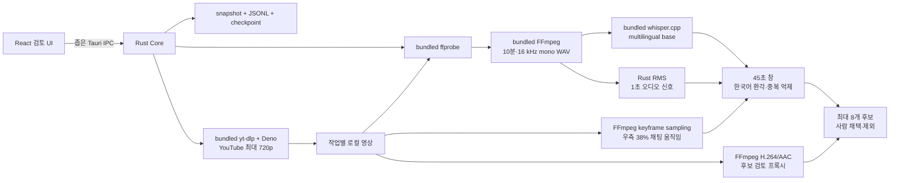

# 아키텍처와 상태 모델

## 현재 실제 경로



React는 임의 명령, PID, 파일 시스템을 다루지 않습니다. Rust가 입력 검증, 고정된 실행 파일과 인자, 자식 프로세스 종료, 저장을 소유합니다.

React 검토 UI의 구현 담당은 버전 시작 승인 시 확정하며 현재 문서 정본은 Codex/Sol이 관리합니다.

## 청크와 점수

- `ffprobe`: 재생 시간과 오디오 스트림 존재 확인
- FFmpeg: 10분씩 16 kHz mono PCM WAV 생성
- whisper.cpp: 한국어 고정, 무음 억제 옵션으로 SRT 생성
- Rust: WAV를 1초 단위 RMS로 읽고 SRT 타임코드를 원본 시간으로 보정
- 채팅 움직임: 화면 오른쪽 38%를 64x64 grayscale로 축소해 5초 간격 키프레임 변화량 계산
- 후보 창: 최대 45초
- 점수: 채팅 신호가 있으면 오디오 45% + 발화 35% + 채팅 20%, 없으면 오디오 55% + 발화 45%
- 중복 제거: 후보 시간 겹침 금지, 음성 인식 문장 Jaccard 유사도 0.75 이상 제거
- 플레이어: 후보 앞뒤 여유를 둔 최대 720p H.264/AAC 프록시를 생성하고 작업 안에서 캐시

규칙 점수는 “재미”의 확률이 아니라 먼저 볼 순서를 정하는 휴리스틱입니다.

## 상태

실제 미디어 경로:

`CREATED → ACQUIRING → PROBING → TRANSCRIBING* → AUDIO_SIGNALS → FUSING → RANKING → REVIEW_READY`

YouTube 입력에서 `ACQUIRING`은 yt-dlp 다운로드를 뜻하며 완료 영상과 `acquisition.json`을 저장합니다. 로컬 입력에서는 내장 도구 확인 단계입니다.

`TRANSCRIBING` 한 단위가 한 청크의 FFmpeg 추출·Whisper 음성 인식·체크포인트 저장을 뜻합니다.

교차 상태:

- `CANCELLING → CANCELLED`: 현재 자식 프로세스를 `kill + wait`하고 완료 청크 보존
- 모든 실제 미디어 자식은 Windows Job Object의 `KILL_ON_JOB_CLOSE`에 넣어 부모 앱 강제 종료 시에도 함께 종료
- `INTERRUPTED`: 앱 강제 종료 뒤 복원
- `FAILED`: 도구·입력·체크포인트 오류
- `REVIEW_READY`: 후보 판정 가능

데모 경로는 기존 12단위 fixture와 오류 프로토콜을 유지합니다.

## 저장 구조

```text
%LOCALAPPDATA%/com.vodscout.app/
├─ current-job.json
└─ jobs/{job-id}/
   ├─ snapshot.json
   ├─ snapshot.prev.json
   ├─ events.jsonl
   ├─ acquisition.json          # YouTube 입력만
   ├─ youtube-download/         # 완료 영상, 재개용 .part, yt-dlp cache
   ├─ media-checkpoint.json
   ├─ transcript.json
   ├─ chat-motion.json
   ├─ review-clips/
   │  └─ candidate-01.mp4
   └─ tool-logs/
      ├─ ffprobe.stderr.log
      ├─ yt-dlp.stderr.log
      ├─ ffmpeg-0000.stderr.log
      └─ whisper-0000.stderr.log
```

WAV와 SRT는 한 청크만 작업 디렉터리에 두고 체크포인트 저장 후 삭제합니다. 8시간 영상을 한꺼번에 PCM으로 펼치지 않습니다.

## 재개 일관성

체크포인트를 먼저 저장하고 작업 스냅샷 진행 단위를 다음에 저장합니다. 두 쓰기 사이에서 종료되면 스냅샷보다 앞선 체크포인트 한 청크를 롤백해 다시 처리합니다. 스냅샷이 체크포인트보다 앞서는 손상은 자동으로 숨기지 않고 실패로 표시합니다.

## 배포 리소스

- FFmpeg 8.1 LGPL shared
- whisper.cpp 1.9.1 CPU x64
- multilingual `ggml-base.bin`
- yt-dlp 2026.07.04 Windows x64
- Deno 2.9.4 Windows x64
- 각 원본 URL·SHA-256: `src-tauri/resources/media-tools/manifest.json`
- 라이선스: `src-tauri/resources/media-tools/licenses`

## v0.4.0 목표 경로: 가벼운 전체 탐색 후 선택 정밀 분석

현재 v0.3.3 CPU 경로와 작업 데이터는 유지하면서 장시간 입력에 다음 단계를 추가한다.



```mermaid
flowchart LR
    INPUT["로컬 영상 또는 YouTube URL"] --> TYPE{"입력 종류"}
    TYPE -- "YouTube" --> CAPTIONS["공개 자막 목록 확인\n제작자 원문 우선"]
    CAPTIONS --> CAPTION_QA["언어·범위·시간 순서·중복\n품질과 출처 확인"]
    TYPE -- "로컬 영상" --> PREFLIGHT["하드웨어·저장 공간 확인"]
    CAPTION_QA --> PREFLIGHT
    PREFLIGHT --> INDEX["전체 저비용 색인\n음량·음성·장면·채팅 움직임"]
    CAPTION_QA -- "품질 통과" --> TEXT["통합 시간 정보 색인\n출처·원본 시각 보존"]
    CAPTION_QA -- "없음·공백·품질 미달" --> BUDGET["필요한 음성 구간과\n시간대별 예산"]
    INDEX --> BUDGET
    BUDGET --> WHISPER["검증된 GPU 우선 Whisper\n실패 청크는 CPU"]
    WHISPER --> TEXT
    TEXT --> SEGMENTS["주제·사건 경계 구간"]
    INDEX --> SEGMENTS
    SEGMENTS --> STORY["시작·전개·절정·마무리\n이야기 후보 연결"]
    STORY --> REFINE["상위 후보와 주변 맥락만\n정밀 음성 인식·선별 글자 인식"]
    REFINE --> API["선택형 사용자 API\n축약 후보 재정렬"]
    API --> REVIEW["이야기 후보 + 15~90초 반응 후보\n사람 검토"]
    REFINE --> REVIEW["이야기 후보 + 15~90초 반응 후보\n사람 검토"]
    STORY --> REVIEW
```

외부 AI는 `REFINE → API`에서 사용자가 직접 등록한 API로 축약 후보를 재정렬하는 선택 단계다. API 키·네트워크·사용자 동의가 없거나 호출이 실패하면 규칙 기반 `REFINE → REVIEW` 또는 `STORY → REVIEW` 경로로 완료한다.

## 자원 사용 계약

- 미디어는 순차 스트리밍하며 전체 프레임·PCM·음성 인식 결과를 한꺼번에 메모리에 올리지 않는다.
- 원본 WAV와 프레임은 현재 처리 중인 단위만 유지하고 저장 완료 후 제거한다.
- CPU 음성 인식과 GPU 음성 인식을 동시에 중복 실행하지 않는다. GPU 실패 청크만 CPU로 다시 처리한다.
- 동시 실행 수와 메모리 상한은 하드웨어 확인과 기준선 측정 후 고정한다.
- 디스크 여유 공간이 예상 작업량보다 부족하면 시작 전에 알리고 사용자가 범위·방식을 바꿀 수 있게 한다.
- 캐시가 성능을 높이더라도 입력·자막 개정·모델·장치·설정·후보 계산 버전 지문이 다르면 결과를 재사용하지 않는다.

## 장시간 분석 저장 구조

v0.4.0은 기존 작업 폴더에 다음 파일을 추가하는 방향으로 설계한다. 이름과 스키마 버전은 구현 PR에서 확정한다.

```text
jobs/{job-id}/
├─ captions/                 # 확보한 원본 자막, Git·배포 자산에는 포함하지 않음
├─ caption-inventory.json    # 트랙 종류·언어·출처·파일 해시·확보 시각
├─ timed-text-index.json     # 자막과 로컬 음성 인식 결과의 통합 시간 정보
├─ timeline-index.json       # 전체 저비용 시간축 신호와 사건 경계
├─ whisper-budget.json       # 확인한 구간·남은 예산·CPU/GPU 상태
├─ story-candidates.json     # 이야기 후보와 시작·절정·마무리 근거
├─ analysis-provenance.json  # 자막 개정·CPU/GPU·모델·설정·처리 시간
└─ api-rerank.json           # 제공처·모델·후보 ID·사용량·결과, API 키 제외
```

파일명과 스키마 버전은 구현 PR에서 확정한다. 원본 자막은 작업 데이터이며 일반 Git 커밋·로그·배포 자산에 넣지 않는다. 사용자가 같은 작업을 재개하면 고정된 자막 개정과 해시를 사용하고 새 자막 확인은 명시적인 새 개정으로 저장한다.

사용자 API 키는 작업 폴더가 아니라 Windows 보안 저장소에만 보관한다. 작업 기록에는 제공처·모델·전송한 후보 ID·사용 토큰·재정렬 결과만 남기며 인증 헤더는 남기지 않는다. 사용자 동의 없이 외부로 전송하거나 GPU용 대형 자산을 받지 않는다.

## 이야기 연결 규칙

- 인접 세그먼트의 주제·핵심 단어·화면·시간 간격을 이용해 같은 사건인지 판단한다.
- 사건 시작, 반응 상승, 절정, 해결 또는 장면 전환을 서로 다른 근거로 저장한다.
- 단순히 점수가 높은 순간을 이어 붙이지 않고, 중간 구간의 대화와 장면이 실제로 연결되는지 확인한다.
- 같은 사건을 겹치는 여러 후보로 반복 제안하지 않는다.
- 이야기 후보 안의 반응 후보는 별도 식별자를 갖고 원본 타임코드로 이동할 수 있어야 한다.

정확한 임계값은 사람이 표시한 기준 영상과 v0.3.3 결과를 비교한 뒤 테스트 문서에 고정한다.
