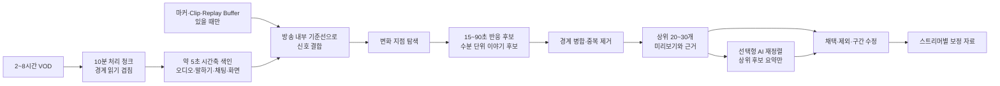

# VOD 편집점 자동 탐색 연구 및 구현 가이드

- 조사 기준일: 2026-08-17
- 대상: 2~8시간 치지직 버츄얼 스트리머의 저스트채팅·게임 다시보기
- 목표: 긴 영상을 사람이 전부 보지 않아도 검토할 만한 편집 후보를 먼저 제안
- 자료 선택 기준: 조회수·좋아요·추천·읽기·GitHub 스타 중 화면에서 확인 가능한 수치가 하나라도 100 이상
- 문서 역할: 구현 근거와 실험 순서를 제공하는 연구 자료

이 문서는 릴리스 정본이나 구현 완료 기록이 아니다. 현재 구현 상태와 v0.4.0 이후 아이디어는 [v0.4.0 P0와 후속 아이디어 계획](V0.4.0-PLAN.md), 완료 기준은 [테스트와 완료 기준](TEST-PLAN.md)을 따른다. 유료 API 추가, 외부 전송, 정확도 홍보를 승인하지도 않는다.

사용자가 확인한 실제 개선 요구사항과 다음 기능 버전의 작업 순서는 [v0.5.0 품질·작업 대기열 개선 계획](V0.5.0-PLAN.md)에 정리한다.

## 결론

가장 현실적인 방식은 **10분마다 영상을 잘라 각 조각을 한 번에 AI에 넣는 방식이 아니라, 10분을 처리·저장 단위로만 쓰고 더 짧은 시간축 신호를 합치는 2단계 탐색**이다.

1. 전체 영상에서는 오디오, 말하기 밀도, 채팅 움직임, 장면 변화처럼 싼 신호를 5초 안팎 단위로 수집한다.
2. 각 방송 안에서 평소 수준보다 급격히 변한 지점을 찾는다.
3. 변화 지점 앞뒤를 붙여 15~90초 반응 후보와 수분 단위 이야기 후보를 만든다.
4. 겹치거나 내용이 같은 후보를 합친 뒤 상위 20~30개만 미리보기로 제공한다.
5. 의미 판단이 더 필요하면 상위 후보의 음성 인식 결과와 신호 요약만 선택형 AI에 보낸다.
6. 사용자의 `채택·제외·구간 수정`을 저장해 스트리머별 선호를 보정한다.

자료에서 가장 일관되게 반복된 신호는 다음과 같다.

- 방송 중 버튼으로 남긴 마커, Twitch Clip, OBS Replay Buffer처럼 사람이 실시간으로 남긴 표시는 가능하면 최우선 신호로 쓴다.
- AI 하나의 판단보다 채팅 급증, 웃음·고함, 말하기 속도, 장면 변화 등 서로 다른 신호의 합이 더 실용적이다.
- LLM은 전체 8시간을 처음부터 읽는 탐지기가 아니라 이미 줄인 후보를 설명하고 재정렬하는 마지막 단계에 적합하다.
- 조회수와 좋아요는 자료를 고르는 필터로는 쓸 수 있지만, 편집점의 정답 라벨로 그대로 사용하면 안 된다.

## 상태 판정

| 항목 | 상태 | 근거 |
|---|---|---|
| 기준 수치 100 이상 자료 50개 이상 | **PASS** | Reddit, X, YouTube, Bilibili, CSDN, GitHub에서 총 60개 확보 |
| 바이브코딩으로 로컬 MVP 구현 | **PASS** | 현재 VOD Scout에 FFmpeg, whisper.cpp, 10분 청크, 오디오·말하기·채팅 점수, 후보 검토 흐름이 이미 있음 |
| 2단계 탐색 구조의 타당성 | **PASS** | 사용자 마커와 여러 저비용 신호를 먼저 쓰는 사례가 여러 플랫폼에서 반복됨 |
| 초기 가중치와 임계값 | **HOLD** | 시작 가설일 뿐, 사람이 표시한 한국어 방송 기준 영상으로 비교 전 |
| 2시간·8시간 정확도와 자원 사용 | **HOLD** | 실제 입력의 처리 시간, 피크 메모리, 임시 파일, 후보 품질 측정 전 |
| 외부 도구의 `90%`, `10배`, `100배` 같은 홍보 수치 | **HOLD** | 같은 입력과 평가 방식으로 재현하지 않음 |
| Zhihu 자료 | **BLOCKED** | 보안 확인 화면 때문에 내용을 안정적으로 검증하지 못해 60개 집계에서 제외 |

## 용어

| 용어 | 이 문서에서의 뜻 |
|---|---|
| 처리 청크 | 취소·재개와 임시 파일 관리를 위한 약 10분 작업 단위. 편집 후보 자체가 아님 |
| 시간축 빈 | 신호를 계산하는 약 5초 단위 |
| 반응 후보 | 쇼츠나 짧은 하이라이트로 검토할 15~90초 구간 |
| 이야기 후보 | 하나의 사건이 시작·전개·절정·마무리로 이어지는 수분 단위 구간 |
| 근거 신호 | 후보 점수에 영향을 준 마커, 채팅, 오디오, 말하기, 의미, 화면 변화 |
| 정밀 분석 | 상위 후보 주변만 더 정확한 음성 인식, 선별 글자 인식 또는 선택형 AI로 확인하는 단계 |

## 현재 VOD Scout와의 연결

### 이미 구현된 기반

현재 코드에서 확인되는 사실은 다음과 같다.

- [`src-tauri/src/media.rs`](../src-tauri/src/media.rs)는 `CHUNK_SECONDS = 600`으로 10분 처리 청크를 만든다.
- 같은 파일은 전체 모드에서 청크를 순차 처리하고 체크포인트에 완료 청크, 음성 인식 결과, 오디오 에너지, 채팅 움직임을 저장한다.
- 현재 후보는 최대 45초 창을 15초씩 이동하며 오디오 반응, 말하기 밀도, 채팅 움직임을 계산한다.
- 채팅 신호가 있으면 `오디오 45% + 말하기 35% + 채팅 20%`, 없으면 `오디오 55% + 말하기 45%`로 점수를 만든다.
- 겹치는 후보와 음성 인식 결과가 매우 비슷한 후보를 제거하고 상위 8개를 반환한다.
- [`src-tauri/src/domain.rs`](../src-tauri/src/domain.rs)와 [`src/types.ts`](../src/types.ts)의 `Candidate`는 시간, 제목, 요약, 음성 인식 결과 일부, 신호별 점수, 총점, 사용자 판정을 보존한다.

### 연구 결과로 보강할 부분

- 청크 경계에서 사건을 놓치지 않도록 읽기 구간에 겹침을 두되, 결과의 소유 구간을 분리해야 한다.
- 영상 전체의 최댓값 하나로 나누는 방식보다 중앙값·분위수 등 방송 내부 기준선을 써야 한 번의 큰 소리에 점수가 눌리지 않는다.
- `왜 이 후보가 나왔는지`를 사람이 확인할 수 있도록 정규화 전 값, 기준선, 기여도, 짧은 이유를 저장해야 한다.
- 마커·Clip·채팅 메시지 수 같은 플랫폼 신호를 가져올 수 있을 때 선택적으로 합쳐야 한다.
- 45초 반응 후보와 수분 단위 이야기 후보를 서로 다른 결과로 다뤄야 한다.
- 사용자가 수정한 시작·끝 시점도 학습·평가 자료로 남겨야 한다.

## 권장 처리 구조



### 1. 처리 청크와 경계

초기 실험값은 `core = 600초`, `readOverlap = 60초`로 둔다. 예를 들어 두 번째 청크의 핵심 범위가 `600~1200초`라면 실제 읽기 범위는 `540~1260초`가 된다. 후보의 대표 시점이 핵심 범위에 들어오는 청크만 그 후보를 소유하게 하면 중복 저장을 피할 수 있다.

`60초`는 확정값이 아니다. 긴 문맥 후보를 지원할 때는 후보 길이와 경계 누락률을 측정해 조정한다. 기존 체크포인트의 `PlannedChunk { offsetSeconds, lengthSeconds }`를 바로 바꾸면 호환성이 깨질 수 있으므로 새 스키마 버전과 마이그레이션 또는 안전한 재계산 규칙이 필요하다.

### 2. 저비용 신호

| 신호 | 계산 예 | 장점 | 주의점 |
|---|---|---|---|
| 사람 표시 | 스트림 마커, Clip 생성 시각, Replay Buffer 저장 시각 | 의도가 직접 반영됨 | 자료가 없는 과거 VOD도 처리해야 함 |
| 채팅 반응 | 메시지 수, 고유 참여자 수, 이모지·반복 급증, 화면 채팅 움직임 | 웃음·놀람·논쟁에 강함 | 채팅이 없거나 오버레이 위치가 다를 수 있음 |
| 오디오 반응 | RMS, 피크, 음량 변화, spectral flux, 웃음·환호 확률 | 게임·토크 모두 싸게 훑기 쉬움 | 배경 음악과 효과음이 오탐을 만듦 |
| 말하기 변화 | 글자 수/초, 단어 수/초, 침묵 뒤 재개, 말하기 속도 급증 | 설명·흥분 구간에 유용 | 음성 인식 오류와 여러 화자에 영향받음 |
| 의미 변화 | 핵심 단어, 질문→결과, 주제 전환, 새 사건 | 조용하지만 중요한 순간 보완 | 전체 영상에 무거운 모델을 쓰면 느림 |
| 화면 변화 | 장면 전환, 움직임, 점수판·결과 화면의 선별 글자 인식 | 게임 결과와 화면 사건 보완 | 게임별 UI 차이, 글자 인식 비용 |

### 3. 방송 내부 정규화

고정 음량 임계값은 스트리머와 게임마다 실패한다. 각 신호를 같은 방송의 평소 수준과 비교해 `0~1`로 바꾼다.

권장 순서는 다음과 같다.

1. 5초 빈의 원시 값을 저장한다.
2. 이동 중앙값 또는 전체 구간 분위수로 평소 수준을 구한다.
3. MAD(중앙값 절대 편차)나 분위수 간격으로 변화 크기를 계산한다.
4. 극단값은 상한을 두어 한 번의 큰 소리가 전체 점수를 지배하지 않게 한다.
5. 채팅처럼 없는 신호는 `0점`이 아니라 `없음`으로 두고 남은 가중치를 다시 맞춘다.

### 4. 초기 점수 가설

다음 값은 자료를 바탕으로 실험을 시작하기 위한 값이지 제품 정답이 아니다.

```text
candidateScore =
    0.30 * markerOrAudienceReaction
  + 0.25 * audioReaction
  + 0.20 * speechExcitement
  + 0.15 * semanticNovelty
  + 0.10 * visualChange
```

- 마커·Clip·채팅이 모두 없으면 해당 30%를 0점으로 만들지 말고 나머지 신호 합이 1이 되도록 다시 맞춘다.
- 사람 마커는 희소하고 의도가 강하므로 단순 평균 외에 후보 생성 트리거로도 취급한다.
- 장르별로 가중치를 달리하기 전, 같은 기준 영상에서 공통값과 장르별 값을 비교한다.
- 현재 제품의 `45/35/20` 가중치를 바로 교체하지 않는다. 기준 영상에서 두 방식을 함께 계산하고 후보 품질과 검토 시간을 비교한 뒤 변경한다.

후보에는 총점만 저장하지 말고 아래처럼 사람이 이해할 수 있는 이유를 함께 남긴다.

```json
{
  "startSeconds": 12431.5,
  "endSeconds": 12492.0,
  "score": 0.87,
  "reasons": [
    "채팅 움직임이 이 방송의 평소보다 3.2배 증가",
    "웃음과 큰 소리가 함께 감지됨",
    "말하기 속도가 주변 구간보다 1.8배 증가"
  ],
  "recognizedTextExcerpt": "..."
}
```

### 5. 후보 생성과 중복 제거

초기 구현 순서는 아래 의사 코드면 충분하다.

```text
for each 10-minute core chunk:
    read core chunk with boundary overlap
    append 5-second feature bins to timeline index

normalize each signal against the same stream's baseline
smooth short noise without erasing sharp reactions
find local peaks and explicit human markers

for each peak:
    expand 15-30 seconds before
    expand 30-60 seconds after
    create a 15-90 second reaction candidate

merge overlapping candidates from the same event
remove candidates with high time overlap or very similar recognized text
rank and expose the top 20-30 candidates with reasons
```

앞쪽 `15~30초`, 뒤쪽 `30~60초`, 상위 `20~30개`도 초기 실험 범위다. 방송 사건은 반응보다 앞에서 시작되는 경우가 많으므로 앞뒤 길이를 같게 고정하지 않는다.

## 저장 형식 제안

기존 `Candidate`를 깨지 않도록 먼저 선택 필드로 근거를 붙이는 방식이 안전하다. 실제 이름과 스키마 버전은 구현 PR에서 확정한다.

```ts
interface CandidateEvidenceV1 {
  schemaVersion: 1;
  candidateId: string;
  sourceChunkIds: string[];
  reasons: Array<{
    kind: "MARKER" | "CHAT" | "AUDIO" | "SPEECH" | "SEMANTIC" | "VISUAL";
    rawValue: number | null;
    baselineValue: number | null;
    normalizedScore: number;
    contribution: number;
    summary: string;
  }>;
  analysis: {
    algorithmVersion: string;
    binSeconds: number;
    model: string | null;
    device: "CPU" | "GPU" | null;
  };
  correction?: {
    originalStartSeconds: number;
    originalEndSeconds: number;
    correctedStartSeconds: number;
    correctedEndSeconds: number;
  };
}
```

필수 규칙은 다음과 같다.

- API 키, 인증 헤더, 원본 영상·음성은 근거 파일에 넣지 않는다.
- 같은 입력·설정에서 재현할 수 있도록 알고리즘 버전과 분석 설정을 기록한다.
- 청크 겹침 때문에 같은 신호가 두 번 들어오지 않도록 소유 범위와 원본 타임코드를 기록한다.
- 사용자의 구간 수정은 기존 후보를 덮어쓰지 말고 원래 값과 수정값을 함께 남긴다.

## 바이브코딩 구현 순서

### M0. 기준 자료와 현재 결과 고정

- 30~60분짜리 방송 3종부터 사람이 반응 후보와 이야기 구간을 표시한다.
- 현재 `build_candidates` 결과와 처리 시간·메모리·후보 검토 시간을 저장한다.
- 말이 많은 방송, 조용한 방송, 게임 화면 변화가 큰 방송을 나눈다.

검증: 같은 입력과 같은 설정으로 현재 결과를 반복 생성할 수 있어야 한다.

### M1. 시간축 색인과 이유 저장

- 주요 파일: `src-tauri/src/media.rs`, `src-tauri/src/domain.rs`, `src/types.ts`
- 5초 단위 원시 신호와 방송 내부 기준선을 별도 파일로 저장한다.
- 현재 `Candidate`에 선택형 근거 데이터를 연결한다.
- UI에는 총점 옆에 상위 이유 2~3개만 보여 준다.

검증: 기존 작업을 열 수 있고, 근거가 없는 이전 후보도 정상 표시돼야 한다.

### M2. 경계 겹침과 후보 병합

- 읽기 범위와 후보 소유 범위를 분리한다.
- 청크 경계 양쪽에 걸친 동일 사건을 하나로 합친다.
- 취소·재개 후에도 후보 ID와 원본 시간이 바뀌지 않게 한다.

검증: 경계 직전·직후에 인공 반응을 둔 fixture와 실제 미디어에서 누락·중복을 확인한다.

### M3. 사람 표시와 채팅 신호

- 가져올 수 있는 마커·Clip 시각을 선택 입력으로 받는다.
- 채팅 로그가 있으면 메시지 수를 사용하고, 없으면 현재 화면 움직임 신호를 유지한다.
- 어느 자료도 없을 때 로컬 오디오·말하기 경로로 끝까지 완료한다.

검증: 선택 자료 유무별로 외부 요청 없이 분석이 완료되고 `없음`이 `0점`으로 오해되지 않아야 한다.

### M4. 의미·화면 신호

- 먼저 키워드, 질문·결과 표현, 침묵 뒤 주제 변화처럼 로컬 규칙을 적용한다.
- 화면 글자 인식은 상위 후보 주변과 지정한 채팅 영역에만 적용한다.
- 선택형 AI는 규칙 결과가 준비된 뒤 기존 후보만 재정렬한다.

검증: API를 끄거나 호출이 실패해도 후보와 사용자 판정이 보존돼야 한다.

### M5. 개인화

- 스트리머별 채택률, 제외 이유, 시작·끝 수정량을 저장한다.
- 충분한 판정 자료가 쌓이기 전에는 자동으로 가중치를 크게 바꾸지 않는다.
- 새 스트리머에는 공통 기준값으로 안전하게 시작한다.

검증: 개인화 전후를 같은 보류 평가 자료로 비교하고, 한 방송의 결과를 전체 장르에 일반화하지 않는다.

## 평가 방법

조회수만 맞히는 모델이 아니라 **편집자가 빨리 좋은 구간을 찾게 하는 도구**로 평가한다.

| 지표 | 기록 방법 |
|---|---|
| 후보 재현율 | 사람이 표시한 사건 중 상위 K개 후보와 겹치는 사건 비율 |
| 상위 후보 적중률 | 상위 K개 중 편집자가 채택한 후보 비율 |
| 시작·끝 오차 | 사람이 확정한 구간과 제안 구간의 초 단위 차이 |
| 수정량 | 채택 후보에서 앞뒤를 얼마나 다시 잘랐는지 |
| 검토 시간 | 영상 1시간당 후보를 검토하는 데 걸린 시간 |
| 중복률 | 같은 사건을 반복 제안한 후보 비율 |
| 조용한 사건 누락 | 반응은 작지만 사람이 중요하다고 표시한 사건의 누락 수 |
| 자원 사용 | 전체 시간, 단계별 시간, 피크 RAM·VRAM, 임시 파일, 최종 작업 용량 |
| 안정성 | 취소·재개, 앱 재실행, 남은 자식 프로세스, 타임코드 재현성 |

합격 수치는 현재 기준선과 사람이 표시한 자료를 확보한 뒤 [테스트와 완료 기준](TEST-PLAN.md)에 고정한다. 단일 영상이나 공개 도구의 홍보 수치만으로 PASS를 선언하지 않는다.

## 조회수·좋아요를 사용할 때의 경계

공개 인기도는 다음 두 용도로만 먼저 쓴다.

1. 참고 자료가 최소한의 관심을 받은 사례인지 거르는 필터
2. 공개된 완성 클립을 약한 참고 신호로 정렬하는 보조값

원시 조회수는 채널 크기, 게시 후 경과 시간, 제목·썸네일, 추천 노출의 영향을 크게 받는다. 학습 자료에 쓴다면 다음처럼 보정한 값이 낫다.

- 게시 후 경과 시간을 반영한 시간당 조회수
- 해당 채널 평소 성과 대비 상대 조회수
- 좋아요/조회수, 댓글/조회수
- 같은 원본 VOD에서 나온 Clip끼리의 상대 순위
- 가능할 때 시청 지속 시간과 이탈 시점
- 최종적으로는 사용자의 채택·제외·구간 수정

공개 플랫폼 수치는 계속 변한다. 아래 값은 2026-08-17 수집 당시 화면에서 보인 값이며 재현 시 다시 확인해야 한다.

## 자료 수집 방법과 증거 한계

- Chrome의 최종 렌더링 결과에서 직접 링크와 화면에 표시된 인기도 수치를 수집했다.
- 검색·목록 화면으로 확인한 자료가 다수이며, 대표 구현 자료는 상세 페이지와 README까지 열어 구조와 제한을 확인했다.
- 모든 60개 페이지의 전체 본문을 직접 검토했다고 주장하지 않는다.
- Reddit·X 사례는 사용자 행동과 요구를 찾는 자료, YouTube·Bilibili는 결과물과 관심도 사례, CSDN은 구현 아이디어, GitHub는 재현 가능한 코드 구조를 보는 자료로 사용했다.
- Zhihu는 보안 확인 화면을 통과하지 못해 제외했다.

## 수집 자료 60개

### Reddit: 사용자 문제와 수동 신호

| ID | 자료 | 확인 수치 | 구현에 주는 시사점 |
|---|---|---:|---|
| R-01 | [6~8시간 Twitch VOD 편집 부담](https://www.reddit.com/r/Twitch/comments/1ptsc5s/anyone_else_overwhelmed_by_editing_68_hour_twitch/) | 178 추천 | 긴 영상 전체를 보는 검토 비용이 핵심 문제 |
| R-02 | [하이라이트 자동 Clip 봇](https://www.reddit.com/r/Twitch/comments/1pjgwop/we_built_a_twitch_bot_that_clips_your_highlights/) | 254 추천 | 방송 중 자동 수집과 사후 검토 수요 |
| R-03 | [Twitch Clips 생성·오프라인 활용 안내](https://www.reddit.com/r/Twitch/comments/epzr8i/all_about_twitch_clips_how_to_create_them_offline/) | 229 추천 | Clip 메타데이터를 강한 후보 신호로 활용 |
| R-04 | [Stream Marker 기능 소개](https://www.reddit.com/r/Twitch/comments/9knjoy/you_can_now_create_stream_markers_on_the_stream/) | 195 추천 | 사람이 누른 시점을 후보 생성 트리거로 활용 |
| R-05 | [Stream Marker 활용법](https://www.reddit.com/r/Twitch/comments/enmw2z/stream_markers_what_they_are_how_to_effectively/) | 187 추천 | 마커 중심 워크플로의 실용성 |
| R-06 | [Stream Marker로 시각 저장](https://www.reddit.com/r/Twitch/comments/8weo94/save_timestamps_with_the_new_stream_markers/) | 187 추천 | 방송 중 저비용 정답 후보 수집 |
| R-07 | [Twitch Clip의 세로 영상 변환](https://www.reddit.com/r/Twitch/comments/ly7z5w/convert_twitch_clips_to_tiktok_friendly_videos/) | 2.4k 추천 | 탐지 뒤 리프레임은 별도 단계로 분리 |
| R-08 | [Clip 자동 편집·업로드](https://www.reddit.com/r/Twitch/comments/r01h9n/automatically_edit_upload_clips_to_tiktok_youtube/) | 592 추천 | 탐지, 편집, 게시를 독립 단계로 설계 |
| R-09 | [Hearthstone 자동 하이라이트 사례](https://www.reddit.com/r/hearthstone/comments/5he743/help_improved_and_automatically_created/) | 326 추천 | 게임별 사건 신호의 가능성 |
| R-10 | [Twitch와 YouTube 스트리머 경험 비교](https://www.reddit.com/r/Twitch/comments/112fc2k/new_streamer_experience_one_week_on_twitch_vs_one/) | 550 추천 | 플랫폼별 발견·성과 차이를 품질과 분리 |

### X: Clip·하이라이트 반응 사례

| ID | 자료 | 확인 수치 | 사용 범위 |
|---|---|---:|---|
| X-01 | [@Twitch 게시물](https://x.com/Twitch/status/2060649500922814847) | 좋아요 114 · 조회 153,869 | 플랫폼 기능·사용자 반응 참고 |
| X-02 | [@NaniRue 게시물](https://x.com/NaniRue/status/2005279850479640811) | 좋아요 1,840 | 인기 Clip 사례 참고 |
| X-03 | [@Santirne 게시물](https://x.com/Santirne/status/2059722170620842394) | 좋아요 101 | 인기 기준을 통과한 사례 |
| X-04 | [@Fabiotweaks 게시물](https://x.com/Fabiotweaks/status/2053183198306111649) | 좋아요 286 | 인기 Clip 사례 참고 |
| X-05 | [@Iron_Cub 게시물](https://x.com/Iron_Cub/status/1722051221626687682) | 좋아요 185 | 인기 Clip 사례 참고 |
| X-06 | [@blossumVT 게시물](https://x.com/blossumVT/status/2065045345604956162) | 좋아요 795 | 인기 Clip 사례 참고 |
| X-07 | [@LorranKangaroo 게시물](https://x.com/LorranKangaroo/status/2052446503055085713) | 좋아요 209 | 인기 Clip 사례 참고 |
| X-08 | [@LoochyTV 게시물](https://x.com/LoochyTV/status/1490854358187081730) | 좋아요 265 | 인기 Clip 사례 참고 |
| X-09 | [@Leesh_Capeesh 게시물](https://x.com/Leesh_Capeesh/status/1483469607616884738) | 좋아요 123 | 인기 기준을 통과한 사례 |
| X-10 | [@pheesekai 게시물](https://x.com/pheesekai/status/1967302127312593265) | 좋아요 1,065 | 인기 Clip 사례 참고 |

X 게시물은 인기도 사례 표본이다. 개별 게시물의 좋아요 수만으로 해당 시점이 자동 탐지 가능한 편집점이었다고 단정하지 않는다.

### YouTube: 결과물과 도구 관심도 사례

| ID | 자료 | 확인 수치 | 사용 범위 |
|---|---|---:|---|
| Y-01 | [Shorts `klrWApLBfHU`](https://www.youtube.com/shorts/klrWApLBfHU) | 조회 10k | 짧은 결과물 사례 |
| Y-02 | [Shorts `3W__tXWJ9yw`](https://www.youtube.com/shorts/3W__tXWJ9yw) | 조회 618 | 짧은 결과물 사례 |
| Y-03 | [Shorts `mW1LoCjaEQY`](https://www.youtube.com/shorts/mW1LoCjaEQY) | 조회 2.1k | 짧은 결과물 사례 |
| Y-04 | [Shorts `zbZ4yTlzyvM`](https://www.youtube.com/shorts/zbZ4yTlzyvM) | 조회 897 | 짧은 결과물 사례 |
| Y-05 | [영상 `eOWbKUln2v4`](https://www.youtube.com/watch?v=eOWbKUln2v4) | 조회 7.3k | 자동 Clip·편집 관심도 참고 |
| Y-06 | [영상 `pfOOAC24JJE`](https://www.youtube.com/watch?v=pfOOAC24JJE) | 조회 6.5k | 자동 Clip·편집 관심도 참고 |
| Y-07 | [Shorts `DP3yFzKr8l4`](https://www.youtube.com/shorts/DP3yFzKr8l4) | 조회 5.1k | 짧은 결과물 사례 |
| Y-08 | [Shorts `5ErhUAWwAx0`](https://www.youtube.com/shorts/5ErhUAWwAx0) | 조회 924 | 짧은 결과물 사례 |
| Y-09 | [Shorts `jCsrjEdeGRk`](https://www.youtube.com/shorts/jCsrjEdeGRk) | 조회 1k | 짧은 결과물 사례 |
| Y-10 | [영상 `27EgrutfXR4`](https://www.youtube.com/watch?v=27EgrutfXR4) | 조회 160k | 높은 관심도의 자동 편집 관련 사례 |
| Y-11 | [Shorts `fE6blYL0bfA`](https://www.youtube.com/shorts/fE6blYL0bfA) | 조회 50k | 짧은 결과물 사례 |
| Y-12 | [Shorts `bknM5Oy0WDc`](https://www.youtube.com/shorts/bknM5Oy0WDc) | 조회 29k | 짧은 결과물 사례 |
| Y-13 | [Shorts `_mteDGR6z3c`](https://www.youtube.com/shorts/_mteDGR6z3c) | 조회 682 | 짧은 결과물 사례 |
| Y-14 | [Shorts `u0hJGWdGJcw`](https://www.youtube.com/shorts/u0hJGWdGJcw) | 조회 18k | 짧은 결과물 사례 |
| Y-15 | [영상 `7Jy5hFpCp8M`](https://www.youtube.com/watch?v=7Jy5hFpCp8M) | 조회 22k | 자동 Clip·편집 관심도 참고 |

### Bilibili: 중국권 결과물·바이브코딩 사례

| ID | 자료 | 확인 수치 | 사용 범위 |
|---|---|---:|---|
| B-01 | [BV1zft1zmEoG](https://www.bilibili.com/video/BV1zft1zmEoG/) | 재생 12k | 중국권 자동 편집 관심도 참고 |
| B-02 | [BV1PXLv6UEWd](https://www.bilibili.com/video/BV1PXLv6UEWd/) | 재생 2,936 | 중국권 사례 표본 |
| B-03 | [BV1pJRRB8EKa](https://www.bilibili.com/video/BV1pJRRB8EKa/) | 재생 7,089 | 중국권 사례 표본 |
| B-04 | [BV16BEn6kE3G](https://www.bilibili.com/video/BV16BEn6kE3G/) | 재생 2,226 | 중국권 사례 표본 |
| B-05 | [BV1jESLBFEYM](https://www.bilibili.com/video/BV1jESLBFEYM/) | 재생 5,621 | 중국권 사례 표본 |
| B-06 | [BV1V84y1M7gi](https://www.bilibili.com/video/BV1V84y1M7gi/) | 재생 12k | 중국권 자동 편집 관심도 참고 |
| B-07 | [AutoClip · BV1CfG3zREom](https://www.bilibili.com/video/BV1CfG3zREom/) | 재생 2,122 · 좋아요 18 | AI 도움으로 9일간 만든 자동 흥미 구간·제목 생성 사례. 로컬 실행이나 LLM API 키 필요 |
| B-08 | [BV16T42167aP](https://www.bilibili.com/video/BV16T42167aP/) | 재생 2,191 | 중국권 사례 표본 |
| B-09 | [BV1fy5T6xEjf](https://www.bilibili.com/video/BV1fy5T6xEjf/) | 재생 119 | 최소 인기 기준 통과 사례 |
| B-10 | [BV1pdj86NETZ](https://www.bilibili.com/video/BV1pdj86NETZ/) | 재생 117 | 최소 인기 기준 통과 사례 |

AutoClip은 바이브코딩 가능성을 보여 주는 사례이지 정확도 증거는 아니다. 저자의 경험과 외부 API 필요 조건을 제품 품질 PASS로 바꾸어 해석하지 않는다.

### CSDN: 구현 아이디어

| ID | 자료 | 확인 수치 | 사용 범위 |
|---|---|---:|---|
| C-01 | [CSDN `101928493`](https://blog.csdn.net/banshen0201/article/details/101928493) | 읽기 358 | 영상 하이라이트 구현 아이디어 참고 |
| C-02 | [CSDN `163164635`](https://blog.csdn.net/2601_95755739/article/details/163164635) | 읽기 194 | 자동 편집 구현 아이디어 참고 |
| C-03 | [CSDN `160670716`](https://blog.csdn.net/weixin_42520239/article/details/160670716) | 읽기 548 · VIP | 접근 제한이 있는 참고 자료 |
| C-04 | [CSDN `160670607`](https://blog.csdn.net/weixin_42566072/article/details/160670607) | 읽기 687 · VIP | 접근 제한이 있는 참고 자료 |
| C-05 | [Faster-Whisper 기반 편집점 탐색](https://blog.csdn.net/weixin_42526087/article/details/163688684) | 읽기 281 | 단어 타임스탬프, 키워드·zero-shot, MoviePy 조합 참고 |
| C-06 | [CSDN `163618675`](https://blog.csdn.net/weixin_29052717/article/details/163618675) | 읽기 236 | 자동 편집 구현 아이디어 참고 |
| C-07 | [CSDN `155938438`](https://blog.csdn.net/blackstone33/article/details/155938438) | 읽기 320 | 자동 편집 구현 아이디어 참고 |

CSDN 글의 코드와 구조는 참고할 수 있지만, 글에 적힌 성능 수치는 같은 입력에서 재현하기 전까지 HOLD다. 일부 글은 VIP 접근 제한이 있고 작성·검증 과정도 확인되지 않았으므로 정본으로 쓰지 않는다.

### GitHub: 재현 가능한 구현 구조와 연구 모델

| ID | 자료 | 확인 수치 | 확인된 핵심 |
|---|---|---:|---|
| G-01 | [`Anil-matcha/AI-Youtube-Shorts-Generator`](https://github.com/Anil-matcha/AI-Youtube-Shorts-Generator) | 4.6k 스타 | 30분 초과 영상을 20분+60초 겹침으로 분할, Whisper 타임스탬프, LLM 인기 가능성 순위, 50% 초과 겹침 중복 제거. 의미 단계에 API 필요 |
| G-02 | [`OStudi/short-video-generator-AI`](https://github.com/OStudi/short-video-generator-AI) | 1.2k 스타 | 로컬 faster-whisper 뒤 LLM 순위, 중복 제거, 상위 N개, 세로 화면 변환 |
| G-03 | [`YILS-LIN/short-video-factory`](https://github.com/YILS-LIN/short-video-factory) | 5.1k 스타 | 자동 짧은 영상 제작 파이프라인 참고 |
| G-04 | [`tryvinci/vinci-clips`](https://github.com/tryvinci/vinci-clips) | 139 스타 | Clip 생성 도구 구조 참고 |
| G-05 | [`line/lighthouse`](https://github.com/line/lighthouse) | 263 스타 | 순간 검색·하이라이트 탐지 모델 7종과 오디오·비디오 특징 지원. README 기준 최대 영상 길이 150초, CPU 특징 제한 |
| G-06 | [`wjun0830/QD-DETR`](https://github.com/wjun0830/QD-DETR) | 251 스타 | 자연어 기반 순간 검색·하이라이트 연구 모델 |
| G-07 | [`TencentARC/UMT`](https://github.com/TencentARC/UMT) | 238 스타 | 영상 순간 검색·하이라이트 연구 모델 |
| G-08 | [`snailma0229/MS-DETR`](https://github.com/snailma0229/MS-DETR) | 205 스타 | 영상 순간 검색 연구 모델 |

GitHub 스타는 코드 품질이나 VOD Scout 적합성의 보증이 아니다. 특히 연구 모델은 짧은 벤치마크 영상, GPU, 별도 학습 자료를 전제로 할 수 있다. 현재 로컬 CPU 제품 경로를 대체하지 말고 평가용 비교 대상으로만 사용한다.

## Codex 작업 시작 체크리스트

다음 작업을 맡은 Codex 또는 개발자는 구현 전에 아래를 확인한다.

1. [v0.4.0 계획](V0.4.0-PLAN.md)과 [테스트 기준](TEST-PLAN.md)의 현재 상태를 읽는다.
2. `git status`와 실행 중인 FFmpeg·Whisper·Cargo·Node 프로세스를 확인해 다른 작업을 덮어쓰지 않는다.
3. 수정하려는 체크포인트 스키마와 이전 작업 데이터 호환 방식을 먼저 정한다.
4. 현재 `build_candidates` 결과를 기준선으로 저장한 뒤 한 단계만 바꾼다.
5. 테스트에는 청크 경계, 신호 없음, 한 번의 극단값, 중복 후보, 취소·재개를 포함한다.
6. 외부 AI 없이 CPU 규칙 경로가 완료되는지 먼저 확인한다.
7. 외부 AI를 연결하려면 제공처, 모델, 전송 범위, 예상 토큰·비용 한도를 사용자에게 먼저 알리고 동의를 받는다.
8. 측정하지 않은 정확도·속도·8시간 지원 수치를 문서나 UI에 쓰지 않는다.

## 이번 문서의 완료 경계

- **포함:** 60개 자료 목록, 구현 결론, 현재 코드와의 연결, 단계별 사양, 저장 형식 초안, 평가 방법, 위험 경계
- **미포함:** 코드 변경, 모델 선택 확정, 가중치 확정, 유료 API 연결, 실제 2시간·8시간 성능 측정
